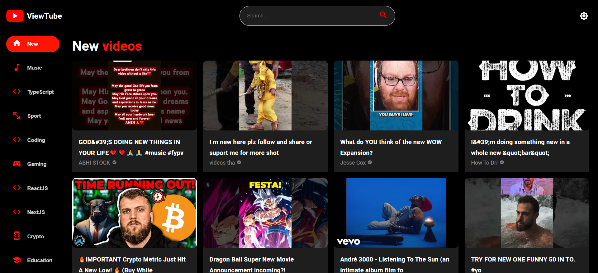

# ViewTube

ViewTube is a modern, responsive YouTube clone built using React, Material-UI, and YouTube Data API. This project replicates the core functionalities of YouTube, allowing users to search for videos, view video details, explore channels, and more, all within an intuitive and visually appealing interface.

## Table of Contents

- [Features](#features)
- [Demo](#demo)
- [Screenshots](#screenshots)
- [Getting Started](#getting-started)
  - [Prerequisites](#prerequisites)
  - [Installation](#installation)

## Features

- **Responsive Design**: Optimized for mobile, tablet, and desktop devices.
- **Search Functionality**: Search for videos across YouTube using the YouTube Data API.
- **Video Playback**: Watch videos directly within the application.
- **Channel Details**: View detailed information about channels, including recent uploads and subscriber count.
- **Dynamic Sidebar**: Browse categories dynamically based on your preferences.
- **Light and Dark Mode**: Toggle between light and dark themes for an optimal viewing experience.

## Demo

Check out ViewTube [here](https://www.yourlink.com).

## Screenshots


_Home Page with search and trending videos_


_Home Page in dark mode_


_Video Playback and related content_


_Video Playback in dark mode_


_Search Page_

## Getting Started

### Prerequisites

Before you begin, ensure you have the following installed:

- **Node.js** (v12.x or higher)
- **npm** or **yarn**

### Installation

1. **Clone the repository:**

   ```bash
   git clone https://github.com/AhmedElsayed200/ViewTube.git
   cd viewtube
   ```

2. **Install dependencies:**

   ```bash
   npm install
    # or
    yarn install
   ```

3. **Set up environment variables:**

   ```bash
   REACT_APP_YOUTUBE_API_KEY=your_youtube_data_api_key
   ```

4. **Start the development server:**

   ```bash
   npm start
    # or
    yarn start
   ```

   Your app should now be running on http://localhost:3000.
